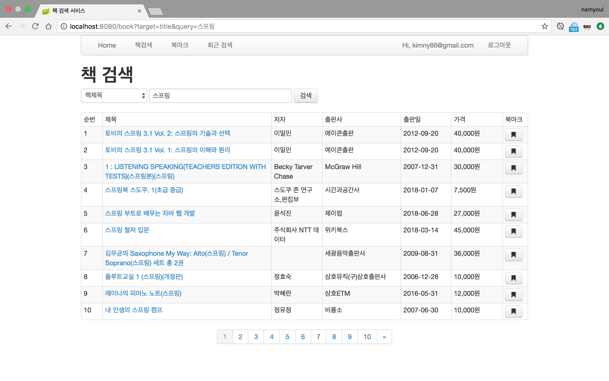
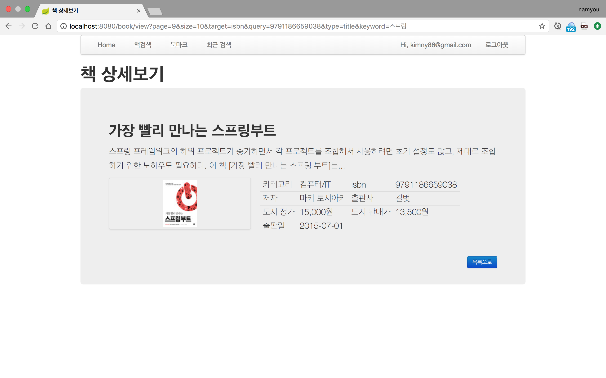
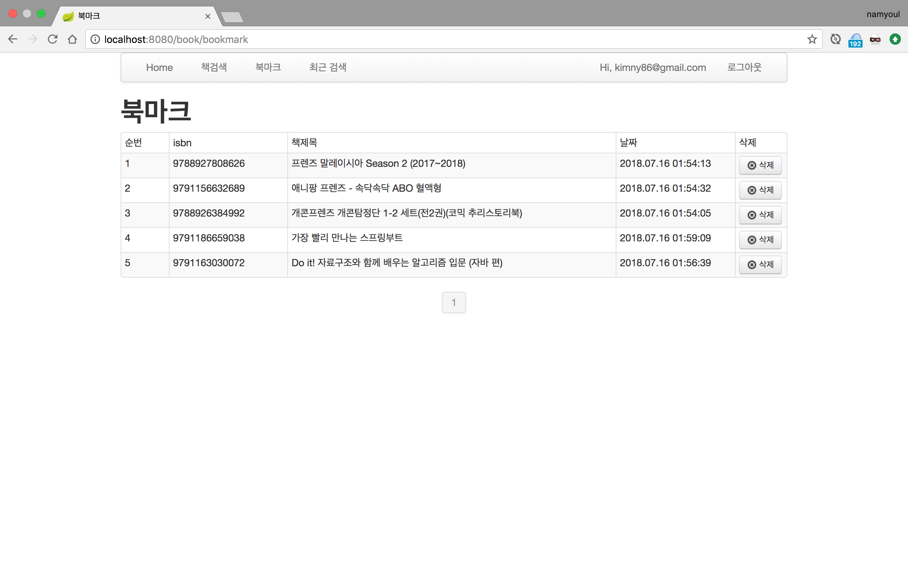
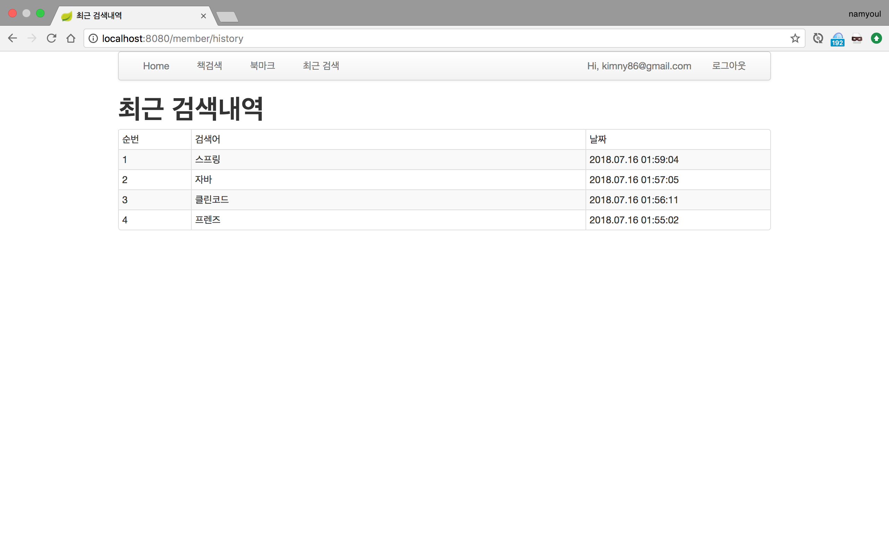

# 카카오 API를 활용한 책 검색 서비스

## 구현목록
- 카카오API를 이용한 책 검색 기능 (페이징)
- 최근 검색 히스토리 (최신날짜 순)
- 북마크 기능 (추가, 삭제)
- 회원가입 기능 (패스워드 암호화)
- 책 상세 정보 조회
- 비지니스 로직 위주로 테스트 케이스 작성

## 사용한 라이브러리 및 오픈소스
- Java8
- SpringBoot
- SpringSecurity
- JPA
- H2DB
- Thymeleaf
- Lombok
- Maven

## 설치 및 실행
- src/main/resources 폴더 하위 경로에 kakao.properties파일 생성 (api키는 보안과 관련된 키값이므로 gitignore에 추가)
```
kakao.api.key=your api key
kakao.api.url=https://dapi.kakao.com/v2/search/book
```

- 실행
```
git clone https://github.com/ooa1769/book-service.git
cd book-service
mvn spring-boot:run
```

- 테스트시 아래 계정 사용(서버 구동시 테스트용 계정 생성)
    - test1@test.com / 1234
    - test2@test.com / 1234
    
## 구현화면
- 책 검색 화면 <br>


- 책 상세 정보 화면<br>


- 북마크 화면<br>


- 최근 검색 히스토리 화면<br>

  